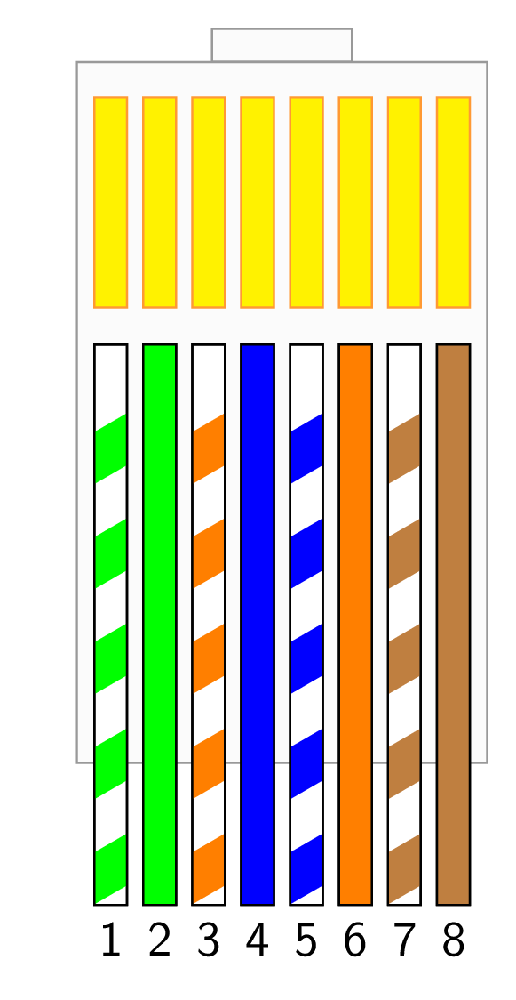
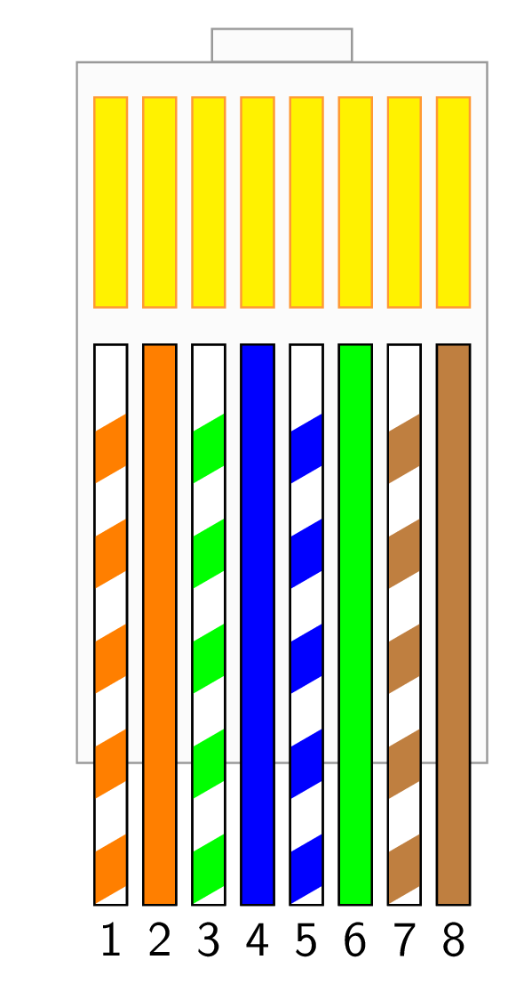

# POS - TIA-568 A/B
Schéma zapojení koncovky RJ45 (TIA-568A a TIA-5658B)

## TIA-568A
<picture>
  <source media="(prefers-color-scheme: dark)" srcset="dist/tia-568A_flatten.png">
  <source media="(prefers-color-scheme: light)" srcset="dist/tia-568A.png">
  
</picture>

## TIA-568B
<picture>
  <source media="(prefers-color-scheme: dark)" srcset="dist/tia-568B_flatten.png">
  <source media="(prefers-color-scheme: light)" srcset="dist/tia-568B.png">
  
</picture>
